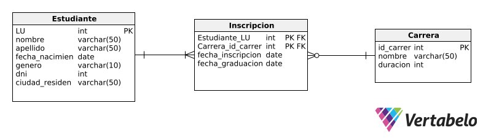

# 📚 Registro de Estudiantes

Proyecto de gestión de estudiantes y carreras universitarias.  
El sistema desarrollado permite registrar estudiantes, inscribirlos en carreras, consultar inscripciones y verificar si un estudiante se ha graduado.

Este proyecto fue realizado en el marco de la asignatura "Arquitectura Web" en la Tecnicatura Universitaria en Desarrollo de Aplicaciones Informáticas (TUDAI), UNICEN.

## 🎯 Objetivos del proyecto

- Diseñar un modelo de objetos y un diagrama DER para el registro de estudiantes.
- Implementar consultas con **JPQL** para dar de alta, inscribir y recuperar información de estudiantes y carreras.
- Generar un reporte de carreras con inscriptos y egresados por año.
- Utilizar los patrones de diseño de arquitectura aprendidos

## 🛠️ Tecnologías utilizadas
- **JAVA 21**
- **JPA / Hibernate** (API para implementar mapeo objeto-relacional)
- **JPQL** (para hacer consultas de persistencia en Java (JPA)
- **MySQL** (base de datos relacional)
- **Docker** (para levantar la base de datos)
- **IntelliJ IDEA Ultimate** (IDE de desarrollo)
- **Maven** como gestor de dependencias
- **Lombok**

## 📊 Diagramas
### Diagrama de Clases (UML)


### Diagrama Entidad-Relación (DER)



## 🏗️ Patrones de diseño aplicados
En el desarrollo del sistema se utilizaron los siguientes patrones de diseño arquitectónico:
- **Repository**: para aislar la persistencia de una entidad.
- **DTO (Data Transfer Object)**: transferencia de datos entre capas de la aplicación, desacoplando la entidad de la lógica de negocio (ocultando la información de mis entities). → seguridad, separación de intereses, performance.
- **Singleton**: para garantizar que una clase tenga una única instancia en toda la aplicación (usado cuando se crea el `EntityManagerFactory`, y las clases `RepositoryImpl`).
- **Factory**: proporciona una interfaz para crear objetos sin exponer la lógica de instanciación al cliente. En este proyecto, se utiliza en la clase `JPAUtil` para crear instancias de `EntityManager` bajo demanda, sin que el resto del código tenga que conocer los detalles de su creación.

## 📦 Requisitos previos
- Tener instalado [Docker](https://www.docker.com/).
- Tener instalado [Java JDK 17+](https://adoptium.net/).
- Agregar las dependencias de [Maven](https://mvnrepository.com/)

## 🚀 Cómo levantar el proyecto
1. Clonar el repositorio:
   ```bash
   git clone <https://github.com/EliGramuglia/ArquitecturaWebGrupo1.git>
   cd registro-estudiantes

2.  Levantar la base de datos con Docker 🐳:
    ```bash
    docker-compose up -d

- Si utilizas el IDE Intellij IDEA podes levantarlo aun mas facilmente haciendo click en la seccion de services en el archivo de docker-compose.yml
- Esto inicia un contenedor con MySQL en el puerto 3306.

3. Abrir el proyecto en IntelliJ y ejecutar la clase Main para probar las consultas.

## ⚙️ Configuración de la base de datos
La configuración de la persistencia se encuentra en el archivo `persistence.xml`.  
En este archivo se definen las entidades y las propiedades de conexión a la base de datos MySQL.

### Propiedades principales a configurar:
- **Driver JDBC**: `com.mysql.cj.jdbc.Driver`
- **URL de conexión**: `jdbc:mysql://localhost:3306/Entregable2?createDatabaseIfNotExist=true`
- **Usuario**: `root`
- **Contraseña**: *(vacía por defecto, cambiar según tu entorno)*

Ejemplo de configuración dentro del archivo `persistence.xml`:

    <properties>
            <property name="javax.persistence.jdbc.driver" value="com.mysql.cj.jdbc.Driver" />
            <property name="javax.persistence.jdbc.url" value="jdbc:mysql://localhost:3306/Entregable2?createDatabaseIfNotExist=true" />
            <property name="javax.persistence.jdbc.user" value="tu_usuario" />
            <property name="javax.persistence.jdbc.password" value="tu_contraseña" />
    </properties>

## 🔍 Funciones implementadas:
- Dar de alta un estudiante
- Matricular un estudiante en una carrera
- Recuperar todos los estudiantes, y especificar algún criterio de ordenamiento simple
- Recuperar un estudiante, en base a su número de libreta universitaria
- Recuperar todos los estudiantes, en base a su género
- Recuperar las carreras con estudiantes inscriptos, y ordenar por cantidad de inscriptos
- Recuperar los estudiantes de una determinada carrera, filtrado por ciudad de residencia
- Generar un reporte de las carreras, que para cada carrera incluya información de los inscriptos y egresados por año.  
  Se deben ordenar las carreras alfabéticamente, y presentar los años de manera cronológica

## 👨‍💻 Autores del proyecto
- Acosta Franco
- Cabrera Maria
- Eliana Gramuglia